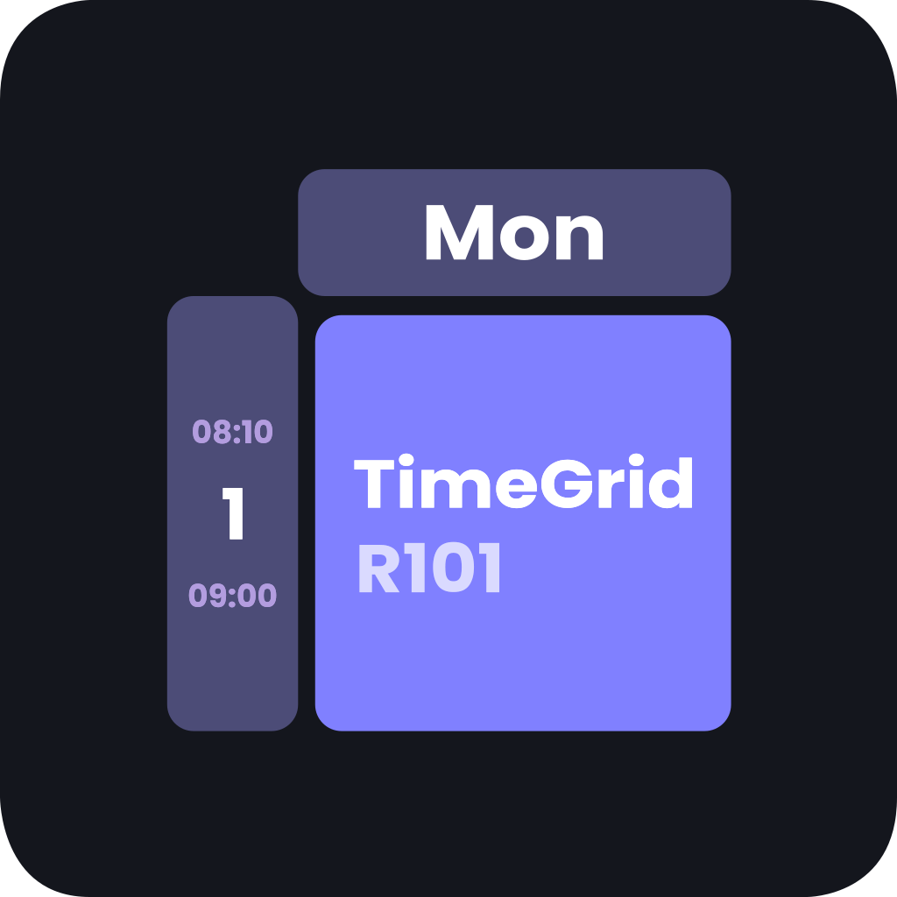
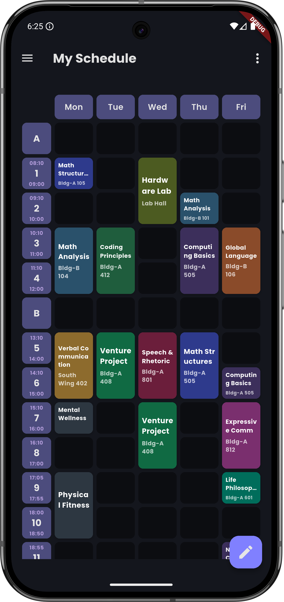

<div align="center">
  
  <h1>TimeGrid</h1>
</div>

<p align="center">
  <a href="https://deepwiki.com/andongni0723/TimeGrid">
    
  </a>
  <a href="https://github.com/andongni0723/TimeGrid/actions/workflows/flutter-ci.yml">
    
  </a>
  <a href="https://github.com/andongni0723/TimeGrid/releases">
    
  </a>
</p>

<p align="center">
  A Flutter class schedule app focused on fast editing, local persistence, and Android home widget support.
</p>

<p align="center">
  
</p>

## Features
- Weekly schedule grid with adjustable days and periods.
- Drag, move, and resize course blocks in edit mode.
- Reusable course chips for quick course and room presets.
- Editable time cells (title, start/end time, and visibility options).
- Import and export schedule data as JSON for backup and migration.
- Android home widget (`Next Course`) for upcoming classes.
- In-app update prompt based on the latest GitHub release.

## Tech Stack
- **Dart**: Main programming language.
- **Flutter (Material 3)**: Cross-platform UI framework.
- **Riverpod**: State management and dependency wiring.
- **Hive**: Local persistent storage for courses, chips, settings, and time cells.
- **Freezed + json_serializable**: Immutable data models and serialization.
- **Android Glance + MethodChannel**: Home widget integration and updates.

## Getting Started
1. Install Flutter SDK (stable channel).
2. Install dependencies:

```bash
flutter pub get
```

3. Run on emulator/device:

```bash
flutter run
```

4. Build Android release APK:

```bash
flutter build apk --release --split-per-abi
```

Get the latest package in [Releases](https://github.com/andongni0723/TimeGrid/releases/latest).
